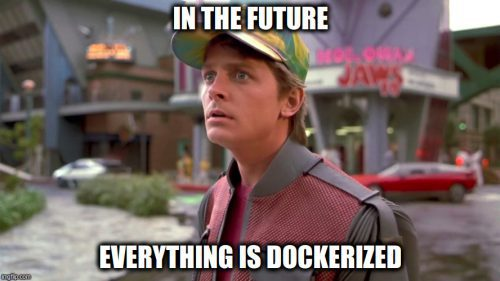

# Docker Diary

My learning diary for Docker.

## Before you start

- **Linux Users**: Installing Docker is a breeze with your package manager. If you’re an Arch Linux user like me, check out my guide to [installing Docker on Arch Linux](arch-linux-installation.md).

- **Windows Users**: Oh, Windows users, bless your hearts. If only you could **switch to Linux** and save yourself some hassle!

- Another option is to use **[Play with Docker](https://labs.play-with-docker.com/)**: It's a playground for Docker where you can try out Docker commands in a matter of seconds.

## Table of Contents

### Docker Fundamentals

- [What is Docker?](what-is-docker.md)
- [Docker File](docker-file.md)
- [Docker Hot Reload and Bind Mounts](docker-hot-reload.md)
- [Docker Volumes](docker-volumes.md)
- [Docker Compose](docker-compose.md)
- [Docker Environment Variables](docker-environment-variables.md)
- [Docker Environments & Multistage Builds](docker-environments.md)
- [Docker with MongoDB & NodeJS](docker-mongodb-nodejs.md)
- [Docker with Nginx, MongoDB & NodeJS](docker-nginx-mongodb-nodejs.md)
- [Pushing & Pulling Images to Docker Hub](docker-push-to-docker-hub.md)
- [Docker Networking](docker-networking.md)
- [Docker Orchestration](docker-orchestration.md)
- [Docker Swarm](docker-swarm.md)

### Commands Sheet

- [Docker Commands](docker-commands.md)

### Hands-On Practice

- [Traffic Light Docker Challenge](https://github.com/hayk96/trafficlight-docker-challenge#vertical_traffic_light-traffic-light-docker-challenge)
    - [My Solution](trafficlight-docker-challenge-solution.md)

- [Dockerize some apps on Github](dockerize-some-apps-on-github.md)

- [Docker related exercises to learn from](https://github.com/Vizuri/docker-exercises/tree/master): I didn't go through it but it looks like a good resource to practice Docker.

- [Sysadmin with Docker](https://hamk-sysadmin-docker.github.io/exercises/):This is also a good resource to practice Docker.

## References

- [Docker Crash Course for Absolute Beginners](https://www.youtube.com/watch?v=pg19Z8LL06w)
- [Ahmed Ayman - Diving With the Whale - Docker Series](https://a7medayman6.github.io/blog/devops/diving-with-the-whale-docker-series/)