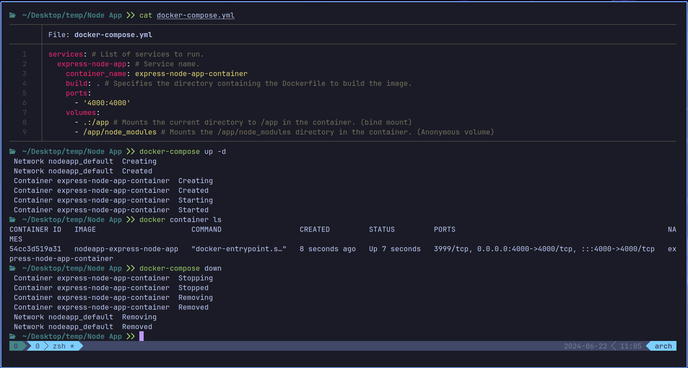

# Docker Compose

Docker Compose is a tool for defining and running multi-container Docker applications. This means you can run a project with multiple containers using a single source.

With Compose, you use a **YAML file** to configure your application's services. Then, with a single command, you create and start all the services from your configuration.

It's a utility you can install. It's not a part of the Docker installation.

To check its version: `docker-compose --version`

## Why Use Docker Compose?

Let's assume you were working on a project that required at least 10 services(e.g. Node.js, MongoDB, Redis, etc.). You have to pull the images, run the containers, and link them together. You will end with a long command like this:

```bash
docker run --name express-node-app-container -v "$(pwd)":/app -v /app/node_modules -d -p 4000:4000 express-node-app
```

This is just for one service. Imagine doing this for 10 services. It will be a nightmare.

Docker Compose simplifies this process. You can define all the services in a `docker-compose.yml` file and run them with a single command.

## Docker Compose Commands

- `docker-compose up`: It reads the `docker-compose.yml` file and starts the services defined in it. So you end up with multiple containers running with a single command.

- `docker-compose up -d`: Starts the services in detached mode. This means the containers run in the background.

- `docker-compose down`: Stops and removes the containers defined in the `docker-compose.yml` file.

## Example 1: Single Service

### `docker-compose.yml` File
 
Here's an example of a `docker-compose.yml` file for a Node.js application that is equivalent to this command :

```bash
docker run --name express-node-app-container -v "$(pwd)":/app -v /app/node_modules -d -p 4000:4000 express-node-app
```

**docker-compose.yml**

```yaml
services: # List of services to run.
  express-node-app: # Service name.
    container_name: express-node-app-container
    build: . # Specifies the directory containing the Dockerfile to build the image.
    ports:
      - '4000:4000'
    volumes:
      - .:/app # Mounts the current directory to /app in the container. (bind mount)
      - /app/node_modules # Mounts the /app/node_modules directory in the container. (Anonymous volume)
```



Notice that the name of the image is `nodeapp-express-node-app`. This is because the `build` key in the `docker-compose.yml` file uses the current directory name with the service name to name the image.

## Example 2: Multiple Services

You can refer to the [Docker with MongoDB & NodeJS](docker-mongodb-nodejs.md#docker-compose-files) section for an example of a `docker-compose.yml` file with multiple services.

--------------------------------------------