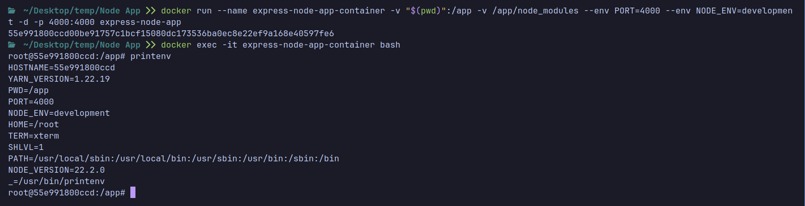
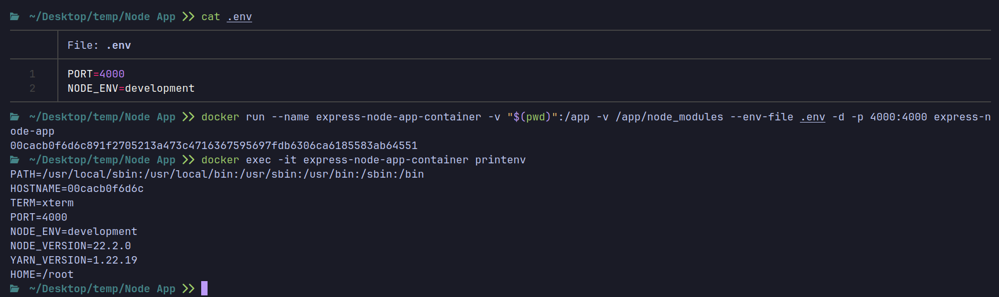
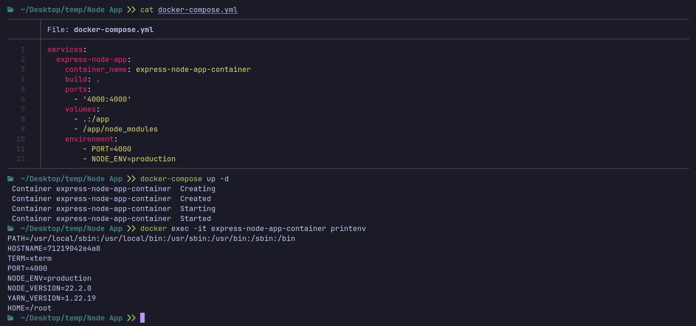
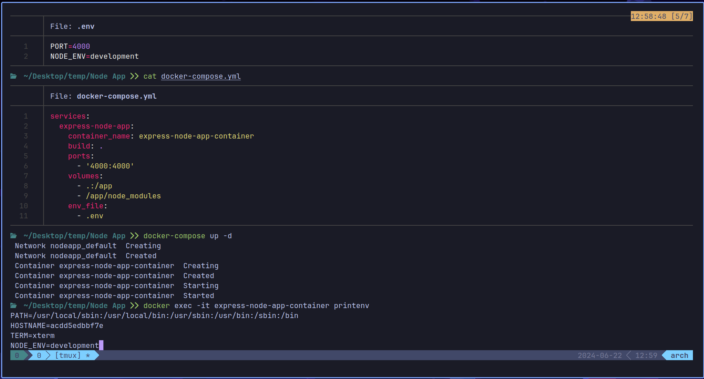

# Docker Environment Variables

Environment variables are key-value pairs that are used to pass configuration settings to Docker containers. They are used to set up the environment inside the container, such as database connection strings, API keys, and other configuration settings.

## Using Environment Variables in Dockerfile

You can use environment variables in a Dockerfile to set configuration settings that can be passed when building or running the container.

```Dockerfile
FROM node

WORKDIR /app

COPY package.json .

RUN npm install

COPY . .

# Use the environment variable PORT or default to 4000
ENV PORT=4000

# Expose the port specified in the environment variable
EXPOSE $PORT

CMD ["npm", "run", "start-dev"]
```

In this example, the `PORT` environment variable is used to specify the port on which the application will listen. The `EXPOSE` instruction exposes the port specified in the `PORT` environment variable.

In node.js, you can access environment variables using `process.env.<variable-name>`. For example, to access the `PORT` environment variable in a node.js application:

```javascript
const port = process.env.PORT || 4000; // Use the PORT environment variable or default to 4000
```

-------------------------

## Passing Environment Variables at Runtime

### Using the `-e`or `--env` Flag

You can pass environment variables to a Docker container at runtime using the `-e` or `--env` flag with the `docker run` command.

```bash
docker run -env MY_VAR1=value1 -env MY_VAR2=value2 my-image
```

**Examples:**

```bash
docker run -e PORT=5000 my-image
```

```bash
docker run -e NODE_ENV=production -e DB_URL=mongodb://localhost:27017/mydb my-image
```

```bash
docker run --name express-node-app-container -v "$(pwd)":/app -v /app/node_modules --env PORT=4000 --env NODE_ENV=development -d -p 4000:4000 express-node-app
```


In the above example, we are passing the `PORT` and `NODE_ENV` environment variables to the `express-node-app` container.

You can see the environment variables inside the container by running the following commands

```bash
docker exec -it express-node-app-container bash
printenv
```

The command `printenv` will display all the environment variables set in the container.

You will see other environment variables set by default in the container.

### Using Environment Files

You can also use environment files to pass multiple environment variables to a Docker container. An environment file is a text file that contains key-value pairs of environment variables.

Create an environment file named `.env` with the following content:

```bash
PORT=4000
NODE_ENV=development
```

You can pass the environment file to the `docker run` command using the `--env-file` flag:

```bash
docker run --env-file .env my-image
```

**Example:**

```bash
docker run --name express-node-app-container -v "$(pwd)":/app -v /app/node_modules --env-file .env -d -p 4000:4000 express-node-app
```



-------------------------

## Using Environment Variables in Docker Compose

You can also use environment variables in Docker Compose to set configuration settings for services defined in the `docker-compose.yml` file.

```yaml
services:
  express-node-app:
    container_name: express-node-app-container
    build: .
    ports:
      - '4000:4000'
    volumes:
      - .:/app
      - /app/node_modules
    environment:
        - PORT=4000
        - NODE_ENV=production
```

In this example, the `environment` section is used to set the `PORT` and `NODE_ENV` environment variables for the `express-node-app` service.


      
You can also use an environment file in Docker Compose by specifying the `env_file` option:

```yaml
services:
  express-node-app:
    container_name: express-node-app-container
    build: .
    ports:
      - '4000:4000'
    volumes:
      - .:/app
      - /app/node_modules
    env_file:
      - .env
```


In this example, the `.env` file is used to set the environment variables for the `express-node-app` service.

-------------------------