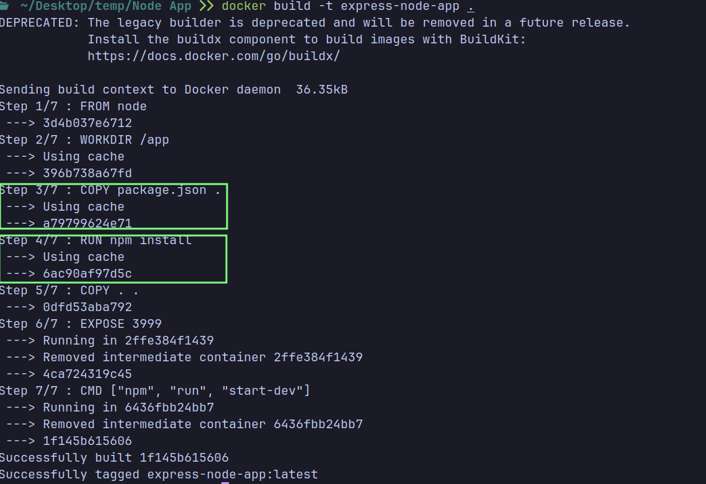

# DockerFile

A Dockerfile is a text file that contains a set of instructions for building a Docker image.

## Example Dockerfile

```Dockerfile
# Description: Dockerfile for the nodejs application

# Use the official image as a base image for the application
FROM node:13

# Set the working directory for the application in the container
WORKDIR /app

# Copy the package.json file from the current directory(host) to the working directory(container)
COPY package.json .

# Install the dependencies for the application
RUN npm install

# Copy all the files in the current directory(host) to the working directory(container)
COPY . .

# Expose the port 3999 for the application
EXPOSE 3999

# Start the application
CMD ["npm", "start"]
```

## Syntax

- `FROM <image-name>:<tag>` - Specifies the base image for the Dockerfile
    - E.g. `FROM node:14` will use the `node` image with the `14` tag as the base image

- `WORKDIR <directory>` - Sets the working directory for the instructions that follow it in the Dockerfile (e.g. `RUN`, `COPY`, etc.). If the directory does not exist, it will be created.
    - E.g. `WORKDIR /app` will set the working directory to `/app` inside the container

- `COPY <source> <destination>` - Copies files from the host machine to the container
    - E.g. `COPY . /app` will copy all the files from the current directory on the host machine to the `/app` directory inside the container
    - E.g. `COPY . .` will copy all the files from the current directory on the host machine to the current directory inside the container

- `RUN <command>` - Executes a command in a shell inside the container
    - E.g. `RUN npm install` will install all the dependencies for a Node.js application inside the container

- > While `RUN` is executed in the container, `COPY` is executed on the host machine.


- `EXPOSE <port>` - Specifies the port on which the container listens for incoming connections
    - E.g. `EXPOSE 3999` will expose port `3999` for the application inside the container
    - > `EXPOSE` does not actually make the port accessible from the host machine. To make the port accessible, you need to use the `-p` flag with the `docker run` command. More on this later.

- `CMD ["executable", "param1", "param2"]` - Specifies the command to run when the container starts
    - E.g. `CMD ["npm", "start"]` will run the `npm start` command when the container starts
    - There can only be one `CMD` instruction in a Dockerfile


## Base Image `FROM`

- Dockerfiles start from a parent image or **base image**. The base image can be any image available on Docker Hub or a custom image created by you.

- It's a Docker image that your image is based on. It's like the foundation of a building. You can build on top of it, but you can't change it.

- You choose a base image based on the requirements of your application. For example, if you are building a Python application, you might choose the `python` image as your base image.

- Each image consists of multiple image layers. E.g. you can have a base image with an OS, then add a layer with Python, then add a layer with your application code.
    - This makes Docker so efficient. If you have multiple images that share the same base image, Docker only needs to store the base image once.

## Docker Container File System `COPY`

- Docker containers have their own file system that is isolated from the host machine's file system. This means that any changes made inside the container do not affect the host machine.

- The structure of a Docker container file system is similar to a Linux file system. It has directories like `/bin`, `/etc`, `/usr`, etc.

------------------------------------------------------------

## Building an Image from a Dockerfile

- To build an image from a Dockerfile, you use the `docker build` command.

- The `docker build` command takes the following syntax:
    ```bash
    docker build -t <your-image-name>:<tag> <path-to-your-dockerfile>
    ```
------------------------------------------------------------

## Docker Cache Mechanism

- Docker uses a cache mechanism to speed up the build process. It caches the layers of the image that have not changed since the last build. <br>

- For example, the first time you build an image, Docker executes all the instructions in the Dockerfile. The second time you build the image, Docker reuses the cached layers and only executes the instructions that have changed

### Why `COPY package.json .` in a Separate Step?

- In the example Dockerfile, the `package.json` file is copied to the container in a separate step before copying all the files. This is done to take advantage of Docker's caching mechanism.

- `npm install` installs all the dependencies listed in the `package.json` file. If the `package.json` file has not changed since the last build, Docker will use the cached layer for that step and not execute the `npm install` command again. This speeds up the build process.



------------------------------------------------------------

## Minimize the Number of Layers

- Each instruction in a Dockerfile creates a new layer in the Docker image. Layers are like the building blocks of your Docker image. When you run docker build, each instruction (like `RUN`, `COPY`, or `ADD`) creates a new layer.

- It's a good practice to minimize the number of layers in your Docker image. This is because each layer adds overhead to the image size and build time.

- Fewer layers result in a smaller image size. Combining commands that can be executed together into a single statement minimizes the number of layers. This reduces redundancy and helps create a more efficient image.

- For example, if you have multiple `RUN` instructions in your Dockerfile, you can combine them into a single `RUN` instruction to reduce the number of layers.

**Bad Practice:**
```Dockerfile
RUN apk add --no-cache npm=7.17.0-r0
RUN npm install
```

**Good Practice:**
```Dockerfile
RUN apk add --no-cache npm=7.17.0-r0 && \
    npm install
```

------------------------------------------------------------

## DockerIgnore File `.dockerignore`

- Do you need to copy all the files in your project directory to the Docker container? No, you don't. You should only copy the necessary files and directories required to run the application.

- For example, if you are building a Node.js application, you will have a `node_modules` directory that contains all the dependencies. You don't need to copy this directory to the container because you are already installing the dependencies using `npm install` in the Dockerfile. Also, you might have some log files, editor configuration files, etc., that are not required in the container.

- If you're using the `COPY . .` command in your Dockerfile, it will copy all the files and directories from the current directory on the host machine to the current directory in the container. So, you need a way to exclude unnecessary files and directories from being copied to the container.

- To exclude unnecessary files and directories from being copied to the container, you can use a `.dockerignore` file. It works similar to a `.gitignore` file.

- The `.dockerignore` file contains a list of files and directories that should be excluded when building the Docker image.

- Example `.dockerignore` file:

    ```python
    # Ignore node_modules directory
    node_modules

    # Ignore all log files
    *.log

    # Ignore Dockerfile and .dockerignore itself
    Dockerfile
    .dockerignore

    # Ignore git and other version control directories
    .git
    .gitignore

    # Ignore temporary files and directories
    tmp/
    *.tmp
    *.swp

    # Ignore environment variable files
    .env
    ```

------------------------------------------------------------