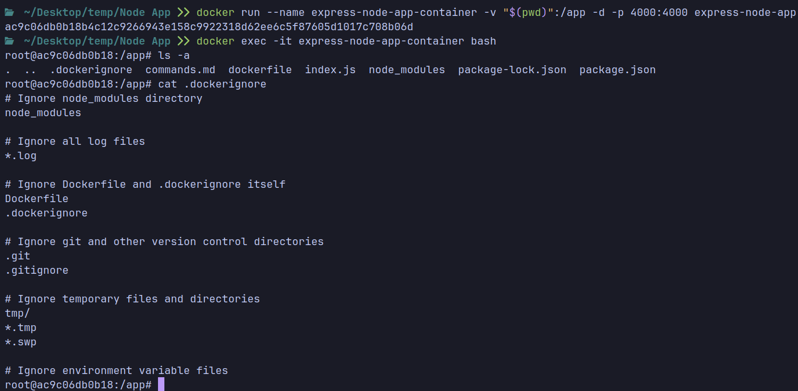

# Docker Hot Reload

## Why Do We Need Hot Reload?

Imagine you are a developer working on a Node.js web application. Your application is built with Express.js, and you are currently in the development phase. You need to frequently make changes to the source code, such as adding new routes, updating business logic, or modifying templates. After each change, you need to stop the server, rebuild the application, and restart the server to see the changes. This process is time-consuming and can be frustrating, especially when you need to make many small changes.

Additionally, you are using Docker to containerize your application. You have a Dockerfile that builds the application image. However, the same issue persists: you need to rebuild the image and restart the container after each change. This process is even more time-consuming because building a Docker image can take a long time, depending on the size of the application and the number of dependencies.

You may think of using a tool like `nodemon` to automatically restart the server when the source code changes. However, `nodemon` only works for the Node.js server running on your local machine, not inside a Docker container. If you use `nodemon` inside a Docker container, it will restart the server inside the container, but the changes you made to the source code will not be reflected because the container is running a different copy of the code. **So, you are back to square one: you need to stop the container, rebuild the image, and restart the container to see the changes.**


This is where **Docker hot reload** comes into play.

## What is Hot Reload?

Docker hot reload is a technique that allows you to automatically update the source code inside a running Docker container without stopping the container or rebuilding the image. With Docker hot reload, **you can make changes to the source code on your local machine, and the changes will be automatically synced to the container,** allowing you to see the changes in real-time without any downtime.

### Important Note

Hot Reload **synchronizes** the files between the host and the container, so any changes made to the files in the host directory will be reflected in the container directory, and vice versa.

If you create/delete a file in the host directory, it will be created/deleted in the container directory and vice versa.

## Hot Reload Using Bind Mounts

You have to synchronize the files between the host and the container. This can be done using volume mounts in the `docker run` command. A volume mount is a way to map a directory on the host machine to a directory inside the container. When you mount a volume, any changes made to the files in the host directory will be reflected in the container directory, and vice versa.

Here is an example of how to use Docker hot reload with a Node.js application if you're in the directory of the project:


```bash
docker run -v $(pwd):/app -d -p 4000:4000 my-node-app
```

> `-v` stands for volume. The `-v` flag is used to specify the volume mount.

`-v $(pwd):/app`: Mounts the current directory (`$(pwd)`) on the host machine to the `/app` directory inside the container. This means that any changes made to the files in the current directory on the host machine will be reflected in the `/app` directory inside the container.

Notice that `-v` must be followed by the **absolute path** of the directory on the host machine. If you use a relative path, Docker will not be able to find the directory.

When you use the `-v` flag to mount a local directory into the container, it overrides the content of the container's directory with the content from your local directory. This means that even if files are ignored during the build process, they will still appear in the container if they exist in the mounted directory.



--------------------------------------------

## Bind Mounts & Anonymous Volumes

If you're using bind mounts to link a directory from the host machine to a directory inside the container but haven't executed `npm install` locally, you won't have the `node_modules` directory in your local directory. Consequently, the container will lack this directory due to the bind mount which will result in an error when you try to run the container.

So all the below steps are worthless if we use bind mounts because the container will have always access the latest version of the files in the host machine. So what isn't in the host machine won't be in the container.

```bash
COPY package.json .

RUN npm install

COPY . ./
```

To solve this issue, you can use an **anonymous volume** to create a volume inside the container that will store the `node_modules` directory. This way, the container will have access to the required dependencies even if the bind mount doesn't include them.


```bash
docker run -v $(pwd):/app -v /app/node_modules -d -p 4000:4000 my-node-app
```

In this command, `-v /app/node_modules` creates an anonymous volume inside the container at the `/app/node_modules` path. This volume will store the `node_modules` directory, which contains the dependencies required by the application. Even if the bind mount doesn't include the `node_modules` directory, the container will have access to it through the anonymous volume.

Notice that you have to name the folder `node_modules` in the container because it's the default folder name for dependencies in Node.js applications. If you use a different folder name like `modules`, you will end up with an empty `modules` folder in the container and the application will not work.


> The best practice is to mount the directory that contains the source code needed for the application to run, not the entire project directory.

--------------------------------------------

## Bind Mounts

In general, **Bind Mounts are a great tool during development** — they’re not meant to be used in production (since your container should run isolated from its host machine).

### Mounting Volumes as Read-Only `ro`

You can stop the container from writing to the mounted directory by adding `:ro` to the end of the volume mount. This will make the mount read-only. This means that changes made to the files in the container directory will not be reflected in the host directory. (You're only allowed to read from the container, not write to it.)


```bash
docker run -v $(pwd):/app:ro -d -p 4000:4000 my-node-app
```

--------------------------------------------