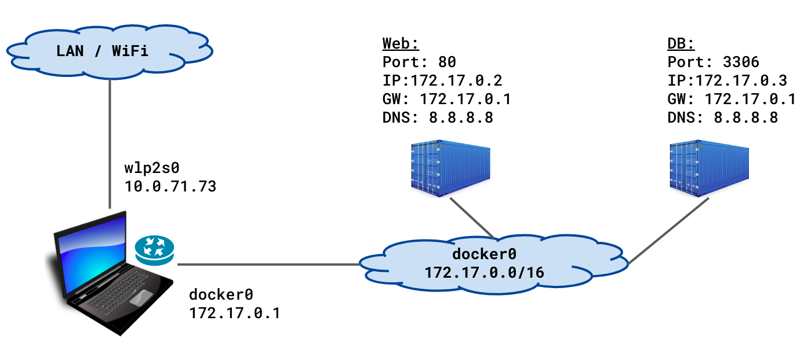
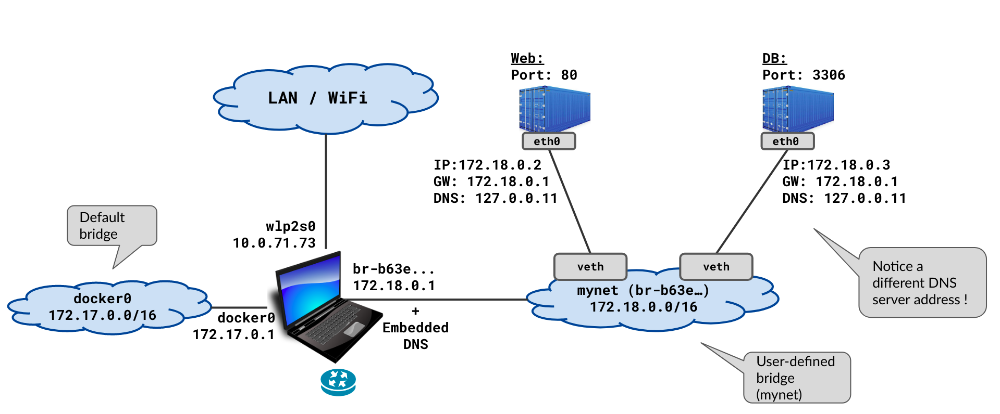
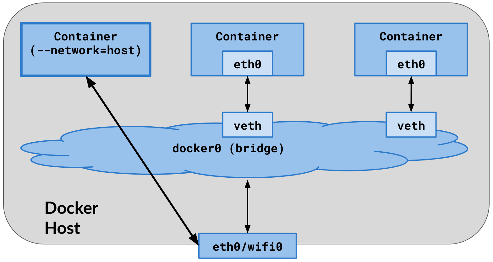

# Docker Networking

When you run applications in Docker containers, these containers need to communicate with each other, with the host machine, and sometimes with external systems. Docker Networking provides the tools and mechanisms to make this possible.

Before we explore Docker Networking in depth, let’s clarify some foundational concepts:

## Container Port vs Host Port

- App inside Docker container runs in an isolated docker network.
- To access the app from outside the container, we need to map the container port to the host port which is called **port binding**.


## Port Binding

- Port binding is the process of mapping a container port to a host port.

- It allows you to expose a container port to the outside world so that other machines on the network can access the application running inside the container.

- It's a standard practice to use the same port number for both the container port and the host port. For example, if your application is running on port 80 inside the container, you can map it to port 80 on the host machine.

- > Note that only 1 service can run on a port at a time. If you try to run a service on a port that is already in use, you will get an error.

- When port binding is configured:
    - Docker creates a mapping between the container port and the host port.
    - The application listens on the container port, while the host listens on the host port.
    - When a request comes to the host machine on the host port, Docker forwards it to the container port.

- If you run two containers that need to talk to each other for example a web server and a database server and use port binding then the wep app container can talk to the database container one of the following ways:
    - Using the container name of the database container: `db-container-name:db-container-port`
    - Using the IP address of the database container : `db-container-ip:db-container-port` - This is not recommended as the IP address of the container can change.
    - Using the host machine IP address: `host-machine-ip:db-container-port`: Because of the port binding, the host machine listens on the host port and forwards the request to the container port.
    - Using all available network interfaces :`0.0.0.0:db-container-port` - When you use this ip address, the service is available on all network interfaces of the host machine.

## Understanding `localhost` in Containers

- In a typical environment, **localhost** refers to the loopback network interface of the host machine, usually with the IP address `127.0.0.1`. When you're working within a Docker container, **localhost** refers to the **container's own loopback interface**, not the host machine's.

- This means that if you run a service inside a container and it listens on `localhost`, it will only be accessible from within the container itself. You can access the service from the host machine by using port binding as explained earlier.


## Docker Host (Docker Engine)

- The Docker host is the machine running Docker. It runs the Docker daemon and manages the containers.

- It can communicate with all containers using **their IP addresses**.


------------------

# Docker Networking Types

Docker networks configure how containers communicate both with each other and with external services.

## None Network Driver

- The none network driver does not attach containers to any network. Containers do not access the external network or communicate with other containers. You can use it when you want to disable the networking on a container.

- Port mapping does not take effect when using the none network driver. `-p` option is ignored. The container is isolated from the network and cannot communicate with the host machine or other containers.


 
## Bridge Network Driver (Default)

- When you install Docker, it creates a virtual bridge network called `docker0`. This bridge network is used to connect containers to the host machine and to each other.

- **By default,** all containers are connected to the default bridge network, unless explicitly configured to connect to some other network.

- `ip addr show` command shows the network interfaces on the host machine. You will see the `docker0` bridge network interface. Note that the `state`is `DOWN` when there are no running containers attached to this network interface/bridge.

- When you start a container, Docker connects it to the `docker0` bridge network **by default**. You can see this by running the `docker network inspect bridge` command.

- You can use this whenever you want your containers running in isolation to connect and communicate with each other. Since containers run in isolation, the bridge network solves the port conflict problem. Containers running in the same bridge network can communicate with each other, and Docker uses **iptables** on the host machine to prevent access outside of the bridge.

- Containers on the same bridge network can communicate with each other using IP addresses. Every time you run a container, a different IP address gets assigned to it.

- External access to a container is granted by exposing ports to the host machine using **port binding**.

- You can list the bridge networks using the following command: `docker network ls`

- There is **no service discovery** in the default bridge network. You have to use IP addresses to communicate between containers.

- Here is how the default bridge network looks like:
    - At start up, Docker engine finds an unused network subnet on the docker host (normally 172.17.0.0/16), and assigns the first IP address of that network (normally 172.17.0.1) to the default bridge - docker0.
    - When you start a container, Docker assigns an IP address from the subnet to the container. The container can communicate with other containers on the same bridge network using this IP address.


### veth Interfaces in Bridge Networks

- Docker uses veth (virtual Ethernet) interfaces to connect containers to bridge networks.

- When containers are run and connected to bridge networks, a pair of network sockets is created. One is assigned to the container as `eth0`, and the other is assigned/connected to the bridge as `vethX`, where X is a random string.

- You can see the veth interfaces using the `ip addr show` command when a container is running.

```bash
dockerhost $ ip addr show
. . .
9: docker0: <... UP,LOWER_UP> ... state UP
    link/ether 02:42:37:9e:00:f6 brd ff:ff:ff:ff:ff:ff
    inet 172.17.0.1/16 brd 172.17.255.255 scope global docker0
. . .
11: veth229dc64@if10: <... UP,LOWER_UP> . . . master docker0 state UP 
    link/ether 2e:a8:cc:3b:78:09 brd ff:ff:ff:ff:ff:ff link-netnsid 0
. . .
13: veth18066aa@if12: <... UP,LOWER_UP> . . . master docker0 state UP 
    link/ether 52:83:73:27:cf:e3 brd ff:ff:ff:ff:ff:ff link-netnsid 1
. . .

dockerhost$ docker inspect web | egrep "MacAddress|IPAddress"
                    "IPAddress": "172.17.0.2",
                    "MacAddress": "02:42:ac:11:00:02",

dockerhost$ docker inspect db | egrep "MacAddress|IPAddress"
                    "IPAddress": "172.17.0.3",
                    "MacAddress": "02:42:ac:11:00:03",

dockerhost$ docker exec web ip addr show
. . .
10: eth0@if11: <...UP,LOWER_UP> . . . state UP . . .
    link/ether 02:42:ac:11:00:02 brd ff:ff:ff:ff:ff:ff link-netnsid 0
    inet 172.17.0.2/16 brd 172.17.255.255 scope global eth0
```


### Notes

- In case there are multiple docker networks on the same computer, containers from one network do not know about containers on the other network, nor can they talk to them. This is a good thing to have for security reasons.

- All containers on any docker (bridge) network, are accessible from the host on the network layer. This is because the host is connected to all the docker networks.


## User-defined Bridge Network

- You can create your own bridge networks using the `docker network create` command. It allows you to create custom bridge networks with specific IP address ranges, subnets, and gateway configurations.

- It has certain advantages most importantly, **service discovery.** Containers on the same user-defined bridge network can communicate with each other using their container names. This is because Docker provides a built-in DNS server that resolves container names to their IP addresses. This makes it easier to connect containers together without having to know their IP addresses.
    > In the default bridge network, you have to use IP addresses to communicate between containers. There is no service discovery since there is no DNS server.



## Compose-Defined Bridge Network

- This is exactly the same as user-defined bridge, except docker-compose creates it automatically, when you bring up a docker-compose based application stack.

- The network prefix is the name of the directory where the `docker-compose.yml` file is located.

## Host Network Driver

- The host network driver allows containers to use the host machine’s network directly, eliminating network isolation between the container and the host. For instance, if a container using the host network is configured to bind to port 80, the application within the container will be accessible on port 80 of the host’s IP address. Essentially, any process within the container that listens on port 80 will be available at `<your_host_ip>:80`.

- You can use the host network if you don’t want to rely on Docker’s networking but instead rely on the host machine networking.

> The host networking driver only works on Linux hosts, and is not supported on Docker Desktop for Mac, Docker Desktop for Windows, or Docker EE for Windows Server.

### Notes

- The container shares the host’s networking namespace
- Container’s network stack is not isolated from the Docker host
- No veth pairs are created on host. All network interfaces of the host are visible inside the container.
- No IP address is allocated to the container, it shares it with the host.
- Port-mapping does not take effect. “-p”, and “-P” options are ignored. Whatever the port of the application inside the container, it is available as-is on the host’s IP address.



## Overlay Network Driver (Multi-Host Networking)

- Allows containers running on different Docker hosts (in a Docker Swarm or Kubernetes cluster) to communicate with each other.

## Macvlan Network Driver

- Macvlan allows containers to appear as physical devices on your network. It works by assigning each container in the network a unique MAC address. Docker then routes traffic to the container based on the MAC address.

----------------
----------------

- [Docker Networking Deep Dive](https://github.com/KamranAzeem/learn-docker/blob/master/docs/docker-networking-deep-dive.md) : This is a very good resource. It explains the networking concepts in detail.