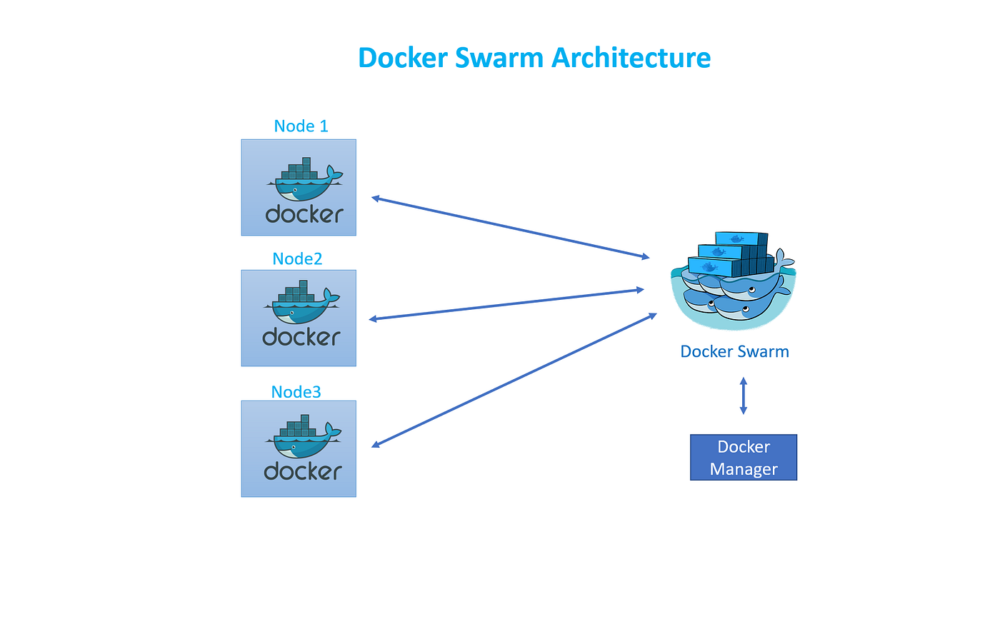

# Docker Swarm

Docker Swarm is an orchestration management tool that runs on Docker applications. It allows you to manage multiple docker nodes (containers) easily.

Docker swarm comes by default with Docker Engine, so you don't need to install it separately. It's inactivated by default.

You can type docker swarm commands in the docker-compose file to manage the swarm.

## Nodes

A node is an instance of the Docker engine participating in the swarm. You can also think of this as a Docker node.

## Docker Swarm Architecture

Docker Swarm works on a master-slave architecture. The master node is responsible for managing the cluster, while the worker nodes are responsible for running the containers.

### Manager Node (Master Node)

- The manager node is responsible for managing the cluster (group of nodes).
- By default, `docker swarm init` command creates a manager node.

### Worker Nodes (Slave Nodes)

Worker nodes are responsible for running the containers. They receive tasks from the manager node and execute them.

--------------------
