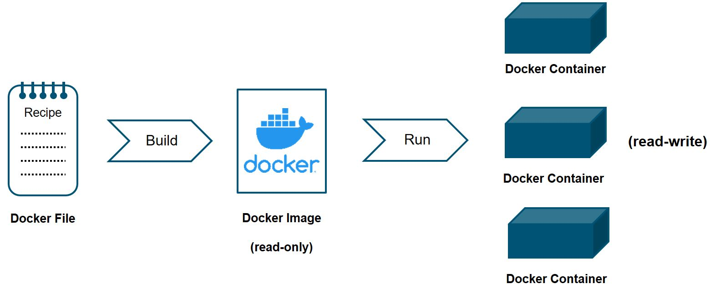
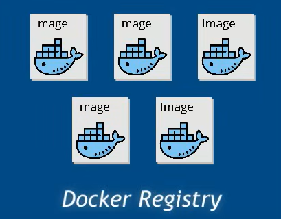

# What is Docker?

- Docker is a containerization platform that packages your application and all its dependencies together in the form of containers.

- Docker containers are lightweight, standalone, and executable packages that include everything needed to run a piece of software, including the code, runtime, system tools, libraries, and settings.

- Docker containers are isolated from each other and from the host system, which ensures that they run consistently across different environments.

> When we say dependencies, we mean an application need Unix environment, with java installed, with some scripts or libraries installed, with certain folders created, and application installed into a specific location.  
So a developer can build a container image having different applications installed on it and give it to his peer developers and the QA team. Then the QA team would only need to run the container image to replicate the developer’s environment.

---------------------------------------------

# Containers Overview

- Containers, in a nutshell, are a way to package up an application and all its dependencies into a single unit and ship it as a single package that can run on any machine.

## Containerization vs. Virtualization

### Virtual Machines (VMs)

- VMs are an abstraction of physical hardware turning one server into many servers. It provides a complete emulation of low level hardware devices like CPU, Disk, and Networking devices.

- The hypervisor allows multiple VMs to run on a single machine. Each VM includes a full copy of an operating system, the application, necessary binaries and libraries – taking up tens of GBs. VMs can also be slow to boot.

### Containers

- Containers are an abstraction at the app layer that packages code and dependencies together. 

- Multiple containers can run on the same machine and share the OS kernel with other containers, each running as isolated processes in user space.

- Containers take up less space than VMs (container images are typically tens of MBs in size).

## Containers != Docker

Docker is a Container Engine and not the only one, actually it’s not even the first one! But we can say it’s almost the best one.

- Containers example: Docker, Podman, LXC, LXD, rkt, etc.

---------------------------------------------

# Why Docker?

- **Portability**: Runs on any machine with Docker, regardless of OS or hardware.
- **Consistency**: Ensures application runs consistently across different environments, from dev to test to prod.
- **Efficiency**: Lightweight containers share the host system's kernel, making them faster and more efficient than VMs.
- **Isolation**: Containers are isolated from each other and the host system.

---------------------------------------------

# Docker Containerization

### Docker File

- A text Document with commands telling docker engine exactly how to build the docker image.

- For example, a docker-file will have instructions like
    - Use Unix image as a base image
    - Update the package-manager repository
    - Install python
    - Copy the project files on it
    - Open ports
    - Run the app using this command

- Here is an example of a Dockerfile:

    

### Docker Image

- An **executable package** that includes everything needed to run a piece of software, from operating system to all the dependencies (such as frameworks) plus deployment and execution configuration to be used by a container runtime.

- Docker image is created from the Docker-file. And the Docker-file contains instructions to include environment, framework, artifacts, configurations etc, So the Docker image actually contains all these.

- A Docker image is a read-only template that contains a set of instructions for creating a container that can run on the Docker platform on any machine that has only docker installed on it. 

### Docker Container

- A single running/stopped instance of a docker image. (Actually starts the application)

- A container represents the execution of a Single application, process, or service. When scaling a service, you create multiple instances of a container from the same image.

- You can think of the relation between the image and it’s container(s) as many things
    - the Image as a class, and the container as an object or instance of that class
    - the image as a Linux distro burned on USB, and the container an installed Linux distro on a machine using this image burned on the USB
    - the relation between the image and the container is one image to many containers, as the image can have multiple containers spanned from it, but each container can come only from one image.

### Docker Registry

- A place to store Docker Images. It can be either a user’s local repository or a central repository that is available to public like Docker Hub.

- A Docker registry is a repository for Docker images. Docker clients connect to registries to download ("pull") images for use or upload ("push") images that they have built.

- **Official images** available from applications like Redis, MongoDB, Postgres, etc. 

- Examples:
    - Docker Hub (Default for Docker and one of the biggest)
    - Azure Container Registry
    - Google Cloud Registry

- **Public Registry**: Docker Hub is a public registry that anyone can use to store and share Docker images.

- **Private Registry**: 
    - All big cloud providers(e.g., AWS, Azure, Google Cloud) have their own private registries. You need to authenticate to access the images.

### Registry vs Repository

- **Registry**: A collection of repositories. A server that stores Docker images.

- **Repository**: A collection of different Docker images with the same name, that have different tags.

> Docker Hub is a registry, and you can host private or public repositories on it.

### Docker Tags

- Tags are used to specify a particular version of an image.
    - e.g., `redis:latest`, `redis:4.0`, `redis:4.0.14`

- If no tag is specified, Docker will pull the image with the `latest` tag by default.

---------------------------------------------